Feature description for Project (Active Research Mode)

### Summary of Project:

The project is a web AI chat interface. It aims to deepen learning and critical thinking with AI, beyond quick passive answers. It uses light persuasion and simple incentives to motivate the user toward behavioural change from passive to active use of AI. Prompts are rated for thoughtfulness. Very passive prompts are rated 0. Very active, thoughtful prompts—for example, using the AI to refine one's own thoughts—are rated 4 to 5. After each reply, copy and sharing unlock only after a quiz. Users must take a short multiple-choice quiz to enable the copy button. There is a quota on how many passive prompts in a 24-hour period are allowed without delay (currently set to 3, but this is configurable). After that, each further passive prompt in the same period triggers a delay: the user waits a set number of seconds before seeing the output. This quota resets after 24 hours. For extra points, users can engage with the reply by attempting to summarize, paraphrase, or critique the AI response in their own words. The system tracks the points earned by the user. When a user earns 100 points (this value can be adjusted based on game settings), the user earns a star to show progress. Each star earned is associated with a certificate in the user's name. It shows the number of stars and includes a short statement confirming the user as a mindful user of AI who refines their thoughts and improves their learning, rather than using AI to replace thinking. There is also a leaderboard. As users earn points, they can see themselves climb the leaderboard in real time.

### Features

#### Feature 1 (Authentication):

- A user is required to register or log in so that the system can track and rate the user's behaviour (mindful use of AI)
  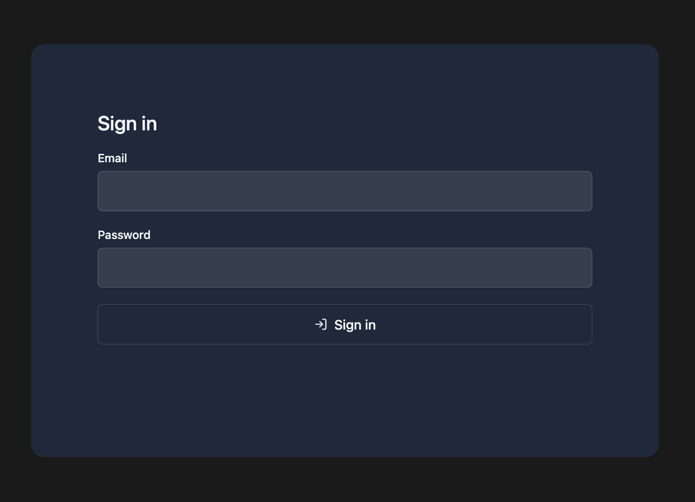

#### Feature 2 (Awareness creation):

- On the new chat page, users can see research-backed facts on how mindless or passive use of AI affects human learning and critical thinking abilities
- Each fact is followed by the author's name and year. When clicked, it redirects the user to the article or research paper
- A new fact is shown to the user every day. This creates awareness, suitable for precontemplation- and contemplation-stage users according to TTM
  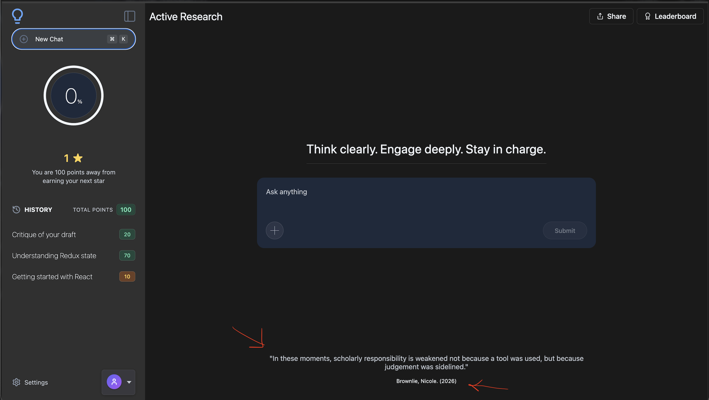

#### Feature 3 (Prompt Scoring)

- We score user prompts based on how passive or active the prompts are
- We define "passive" prompts as prompts that show little thought on the user's part, like asking the AI to write an essay about a topic
- We define "active" prompts as prompts that show that the user has made an effort to understand the topic, is using AI to critique a work, or is asking insightful questions to better understand a concept
- The prompts range from very passive (0 points) to very active (5 points). A few examples are below.

_Passive (0 points)_

> Write a full essay on the state of the art in persuasive computing for me.

_Low (1 point)_

> What is persuasive computing?

_Moderate (2-3 points)_

> Outline the state of persuasive computing and give 3 angles I can compare in my own analysis.

_Active (4-5 points)_

> Here is my draft: "Persuasive computing can help people build better habits. But many apps focus on short-term clicks. I think reflective design may support long-term learning, but the evidence is still limited." Please critique my draft. Tell me its strengths and weaknesses. Suggest clear improvements while keeping my main idea.

- After the system scores a prompt, it provides feedback on the score. The user can view this feedback by hovering over an info icon next to the score
  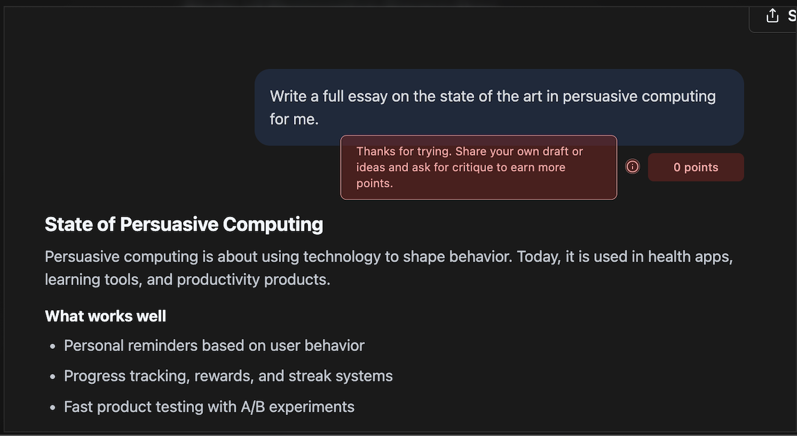
  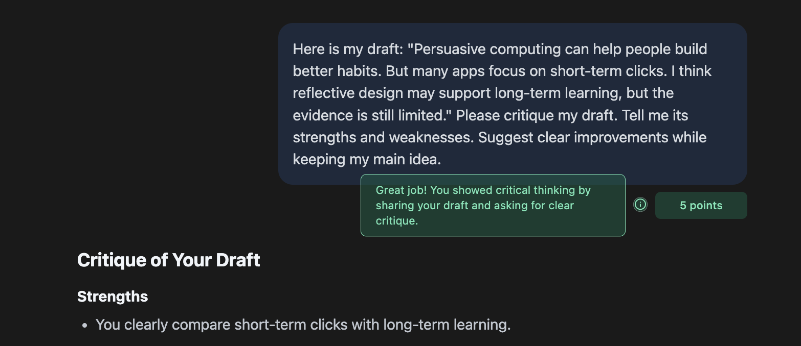

#### Feature 4 (Cognitive friction)

- When the system responds to a prompt, the copy button is disabled by default
- When the user clicks the copy or share button, it opens a list of 3 (this value is configurable) multiple-choice questions
- The user must pass all 3 questions to enable the copy and share buttons
- The user earns extra points (currently 5; also configurable) when they answer all 3 questions correctly
- This does not apply to every reply. For example, responses to questions like "What is the weather today?" or "Who won the 2022 World Cup?" will not require users to answer questions before they can copy the answer
- For future work, we could also allow users to copy the response if the user's prompt is very active—for example, when the user uses the AI to refine their own writing
- A screenshot of the question-answering feature is shown below:
  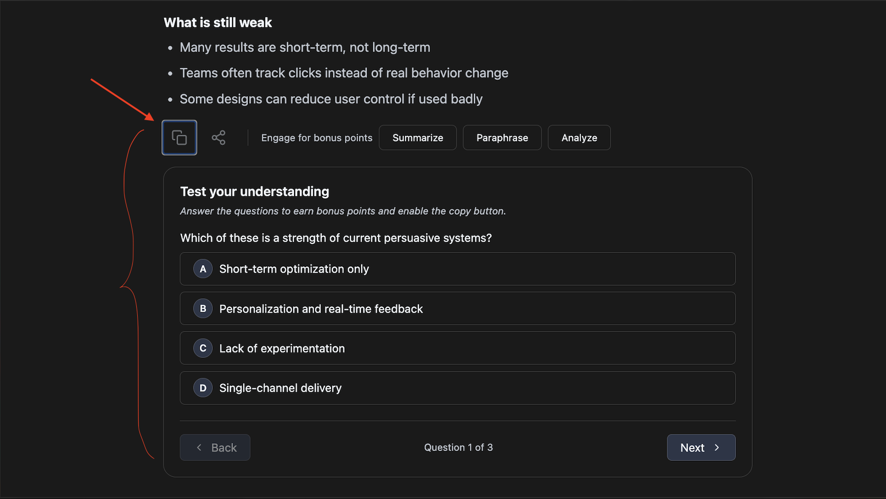

#### Feature 5 (Operant conditioning)

- Within a 24-hour window, the first three zero-point passive prompts are not delayed. Each further zero-point passive prompt in that window triggers a 30-second delay before the response appears. Active prompts are not affected
- This quota resets after 24 hours
- This feature aims to discourage users from giving passive prompts that prevent them from doing any critical thinking or that have the AI do the work for them
  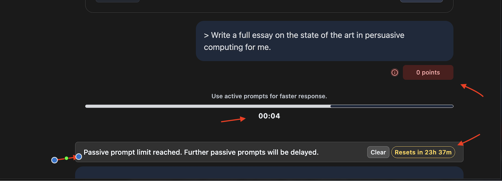

#### Feature 6 (Prompt Engagement) - for extra points

- The user can optionally engage with the AI response to earn extra points
- Currently we have 3 optional engagement types: summarize, paraphrase, and analyze
- The user selects the engagement type, provides their response, and sends it to the system
- The system evaluates the engagement response and awards the user extra points based on the quality and accuracy of the engagement relative to the original AI response. Scores range from 0 (if the summary, paraphrase, or analysis is off-topic, or if the summary is an exact or near-exact copy of the AI's response, the user gets 0) to 5 (where the engagement input by the user shows in-depth reflection on the AI output)
  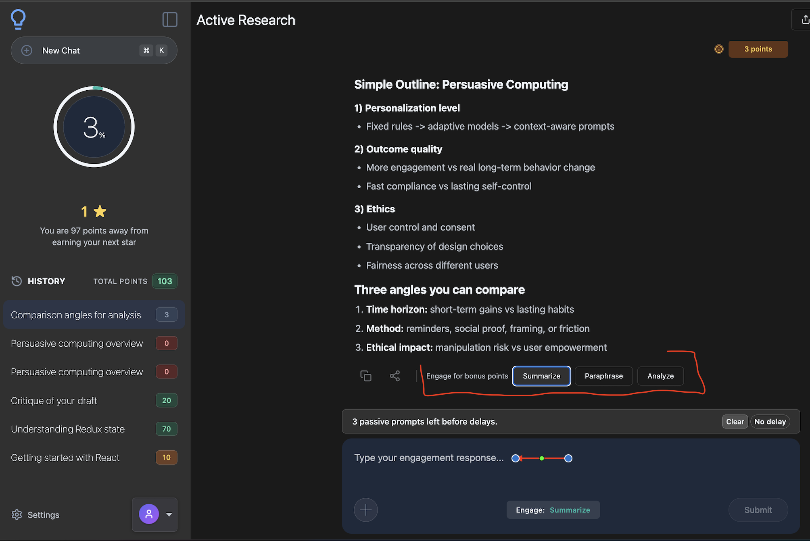

#### Feature 7 (Points, Stars, Leaderboards, and Certificates)

_Points_

- The user will earn points as they use the platform
- All users start with zero points and earn points as they demonstrate thoughtful use of AI
- The total points are accumulated across chats and displayed at the top of the chat history (see screenshots below)
  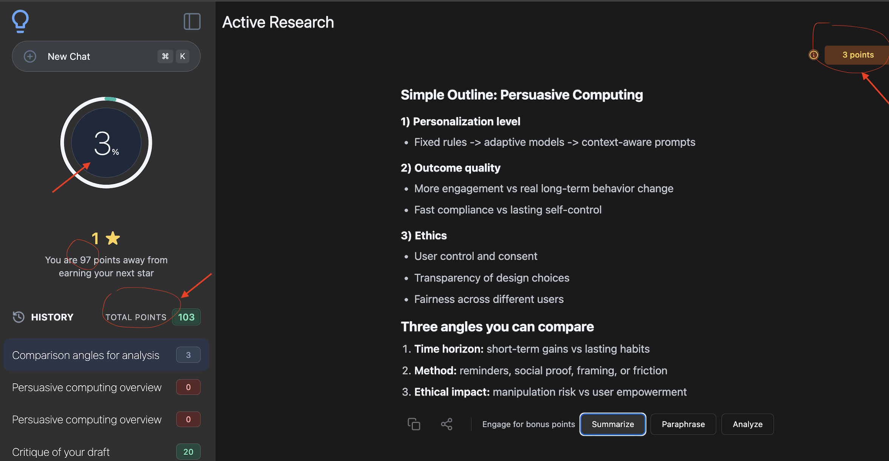

_Stars_

- A user earns a star for every 100th point they earn
- 100 points = 1 star, 200 points = 2 stars, etc.
- On the left panel, the user can track their progress and see how close they are to earning the next star (see screenshot below)
- Each star affords the user a new level and a new certificate
- The star feature is discussed more in the Leaderboard and Certificates sections below
  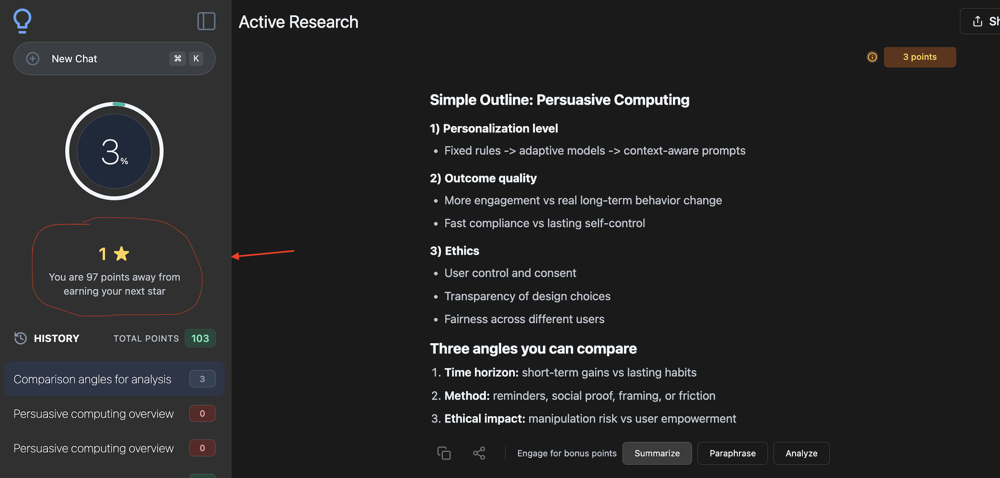

_Leaderboard (tiered)_

- The leaderboard is displayed in the right collapsible panel (toggled by the Leaderboard button in the top right corner of the screen)
- The leaderboard is stratified. This means that it places users in tiers ranging from beginner to advanced (gatekeepers), and users can only see and compete within their own tier
- The leaderboard tiers are as follows:
- Beginners - 0 stars (points 0 - 99)
- Explorers - 1 star (points 100 - 199)
- Thinkers - 2 stars (points 200 - 299)
- Creators - 3 stars (points 300 - 399)
- Leaders - 4 stars (points 400 - 499)
- Gatekeepers - 5 stars (points 500+)

- A user in the Beginner leaderboard only sees users with points ranging from 0 to 99
- As the user earns points, they climb the Beginner leaderboard and see their position on the board change in real time
- When they earn 100+ points, they enter the Explorer leaderboard, where they can see and compare themselves to other users with points from 100 to 199
- The purpose of this design is to avoid demotivating low-performing users (for example, beginners) by placing them in direct comparison with high-performing users
- Having a user with 15 points and 0 stars on the same leaderboard as another user with 350 points and 3 stars may demotivate the 0-star user, while making the 3-star user feel complacent
- A stratified leaderboard can solve that problem by using tiered comparison to keep all users within each layer motivated, much like how school is arranged into levels (year 1, year 2, etc.) to focus people on their grade level
  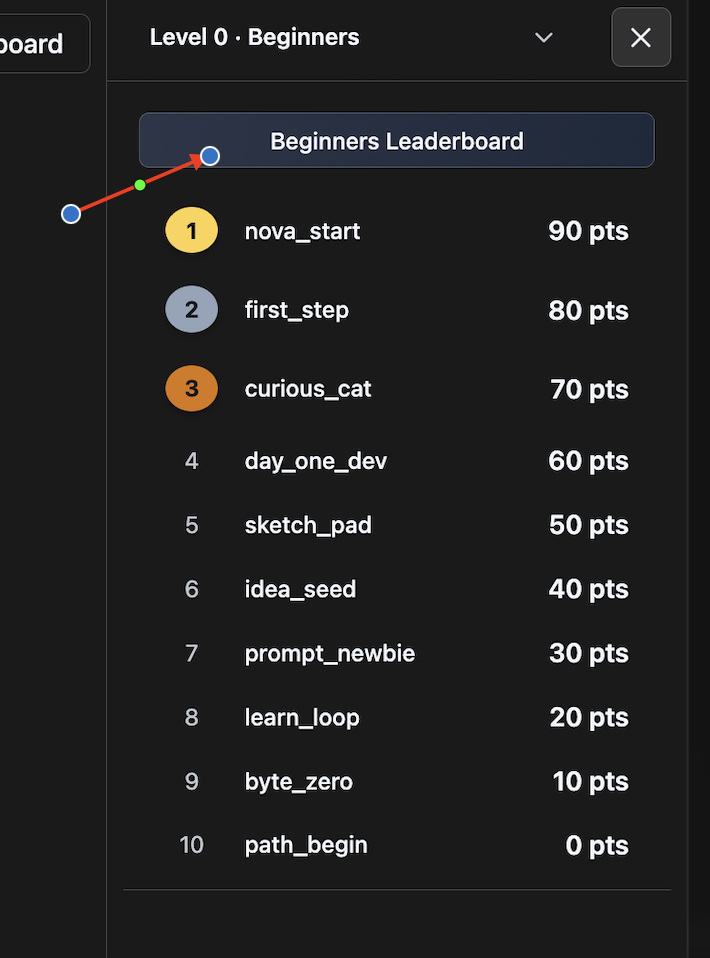
  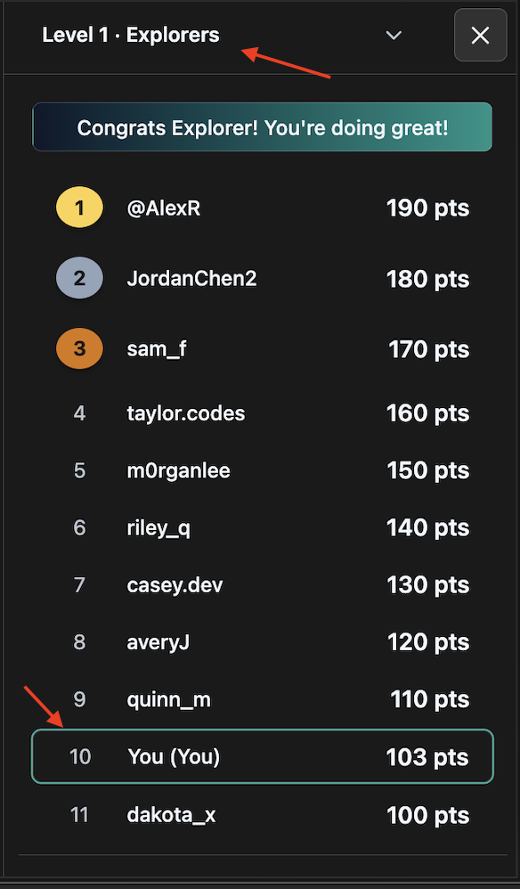

_Certificates_

- The system offers 5 certificate types corresponding to the 5 user levels
- Explorers (1 star), Thinkers (2 stars), Creators (3 stars), Leaders (4 stars), and Gatekeepers (5 stars)
- The certificate is downloadable by clicking the Download certificate button at the bottom of the right panel (see screenshot below)
- At the beginner level, the button is disabled, and is active only after the user has earned their first star

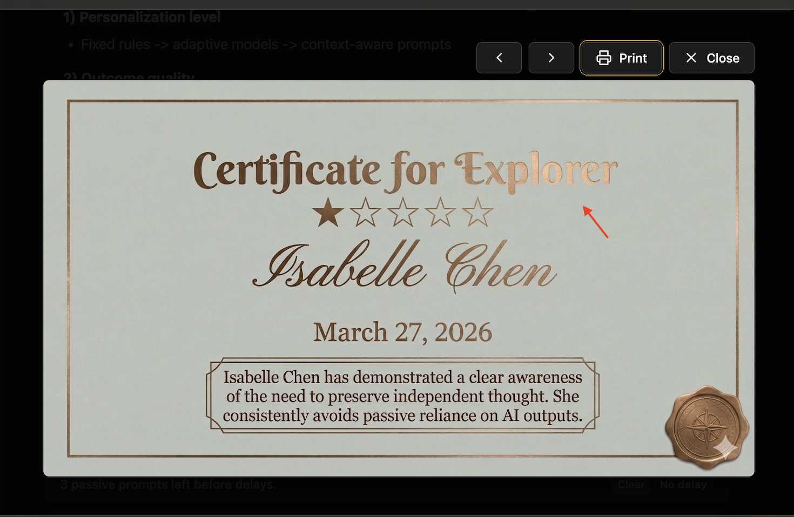
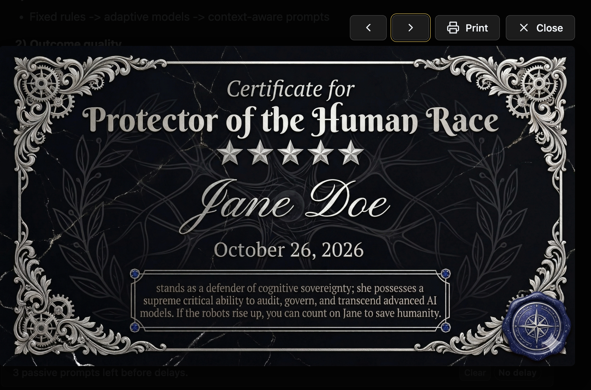
